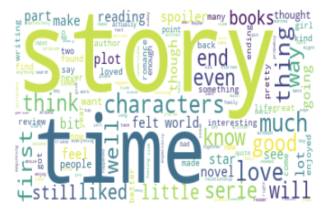
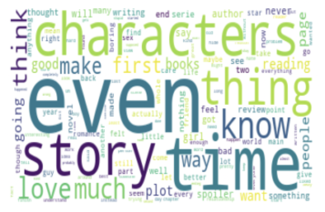

# Goodreads Book Review Analysis

## Project Overview

This project uses reviews which have been assigned a rating to build a machine learning model that can be utilized as a tool by Barnes & Noble.

## Business Understanding

eCommerce has taken over the retail space making it close to impossible for brick and mortar stores to compete with larger retailers such as Amazon, Target, or Walmart.  Over the years we have seen stores begin to close their doors due to the innability to keep up with online competitors.

Goodreads is an online social platform which gives readers the ability to share and rank their most recent books read.  Once a user marks a book read or rates the book, the platform will recommend a new book to the user. A recent study was done which showed 93% of customers will read online reviews prior to purchasing. 

Barnes and Noble is looking to understand what books should be showcased in their stores.  They are looking to get ahead of the game by utilizing a model which can predict the rating of a book on the most popular book reviewed site.

## Data Understanding

This dataset contains more than 1.3M book reviews about 25,475 books and 18,892 users. It was found through the [Kaggle Good Reads Competition](https://www.kaggle.com/competitions/goodreads-books-reviews-290312/overview).

The dataset of this competition is taken from UCSD Book Graph.

### Sample Data

A sample of 100,000 was used from the overall dataset to create the models.  The rating column was then weighted to help with class imbalance.  A zero rating was removed since this is not an actual rating on the Goodreads website

### Two Approaches

#### First Approach (Version One)

The first approach with modeling utilized all ratings individually.  Value counts below:
* 5: 17,195
* 4: 20,215
* 3: 23,560
* 2: 20,834
* 1: 18,196

#### Second Approach (Version Two)

The second approach grouped ratings into two categories.  Where a rating of 5 & 4 were labled as 1 and a rating of 3, 2, & 1 were labeled as 0.  Value counts below:
* 1:37,410
* 0:62,590

## Word Cloud of Individual Ratings's

Word clouds were created show any major differences in word usage throughout the ratings.  Stop words were removed prior to making word clouds.

### Five Rating Word Cloud

### Five Rating Word Cloud

### Five Rating Word Cloud

### Five Rating Word Cloud

### Five Rating Word Cloud

## NLP

Natural Langauge Processing was utilized to clean the book review data.  This process included:
* Standardizing
* Tokeninzing

After cleaning the text data, you could look at frequency of words in the full dataset:

### Word Frequency

## Modeling Process

The same modeling process was done on both versions of rating.  Started modeling with the ratings separeated 1 through 5 and to see if it would improve model performance the ratings were then grouped into two labels, 0 and 1.

Three different models were created before choosing the best fit model.  Before modeling was done, the data was vectorized using TF-IDF Vecotrizer.

### Model Types:
* Baseline Model with Multinomial NB
* Random Forest
* XGBoost

## Final Model Version One: 1 - 5 Rating

The best performing model was Multinomial NB with Gridsearch.

### Confusion Matrix

A confusion matrix was utilized to showcase largest area of mislabeled reviews.

### Classification Report

A classification report was run on the best model.  This model has an accuracy of 47%.

## Final Model Version Two: Ratings Grouped into 1 & 0

The best performing model was Multinomial NB with Gridsearch just as with version one.

### Confusion Matrix

A confusion matrix was utilized to showcase largest area of mislabeled reviews.

### Classification Report

A classification report was run on the best model.  This model has an accuracy of 78%.

## Conclusion & Next Steps

Two versions of modeling was concluded utilizing the dataset. Prior to modeling a sample of 100,000 was taken from the data and the ratings were weighted to help with clas imbalance.

Version One: Utlizing all ratings 1-5. The best fit model was the Multinomial NB which accurately predicted the correct rating 47% of the time. With a score so low it was decided to create a second version, grouping the ratings together to see if it helped with the overall score.

Version Two: Grouped Rating 4 & 5 with the label of 1. Grouped Rating 1, 2, & 3 with the label 0. The best fit model was again Multinomial utilizing Gridsearch to find the best parameters. This model accurately predicted the grouped rating 78% of the time.

It is the recommendation to continue to use version 2 of model with Multinomial NB while utilizing gridsearch best parameters. This will help identify which books are higher rated and should be showcased more prominently in the physical storefronts.

Next Steps would be to continue to build upon the model to be able to increase the amount of reviews which can be inputted while shortening the overall run time.

